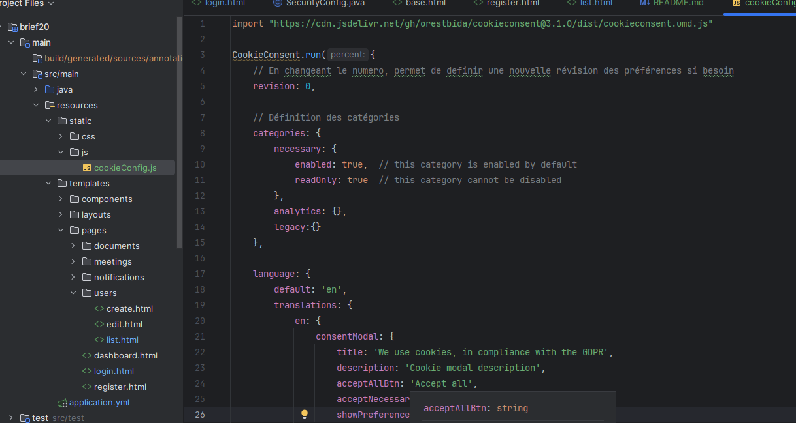
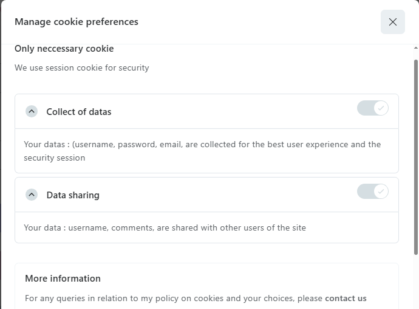
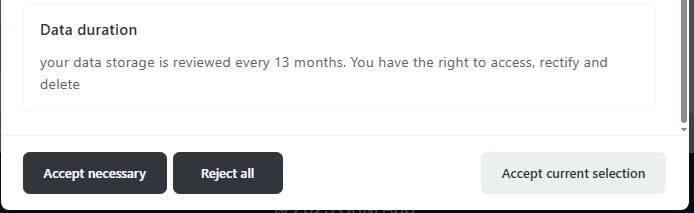
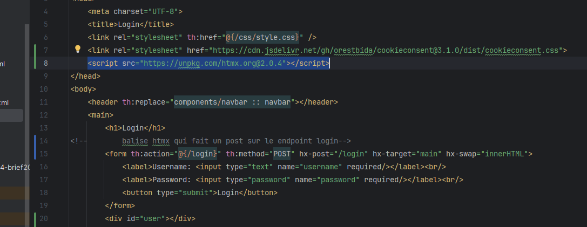
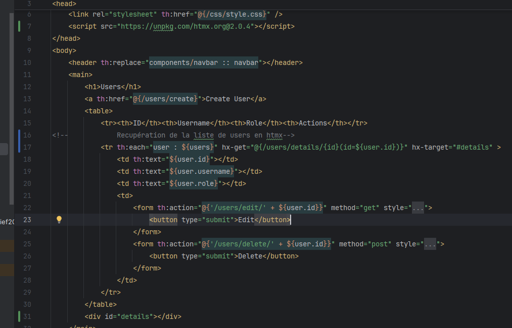

# Brief 20 #

- Mise en place du cookieConsent 
### code ###

### interface ###

- Mise en place du code htmx sur le post du /login 
  des users

- et sur le endpoint get pour récupérer la liste

